# pduck
Duck easy to use.

## Author
[ngi](https://twitter.com/ngingingi)

## License

This work is licensed under a [Creative Commons Attribution-NonCommercial-NoDerivatives 4.0 International License](https://creativecommons.org/licenses/by-nc-nd/4.0/deed.en).

## Usage

### Slack

pduck is compatible with Slack custom emoji.

#### Add One Emoji

To add just one emoji, See [Using Slack](https://get.slack.help/hc/en-us/articles/206870177-Add-custom-emoji) documentation.

#### Add All Emoji with Chrome Extension

To add all emoji in bulk, You can use chrome extension.

[Neutral Face Emoji Tools](https://chrome.google.com/webstore/detail/neutral-face-emoji-tools/anchoacphlfbdomdlomnbbfhcmcdmjej/) is suitable choice.

## Icons

| Name | Image |
| ---  | ---   |
| `:pduck-clock:` | 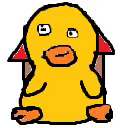 |
| `:pduck-gohome:` | 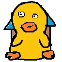 |
| `:pduck-gowork:` | 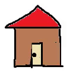 |
| `:pduck:` | 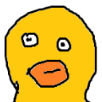 |
| `:pduck_agree:` | 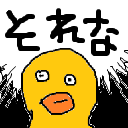 |
| `:pduck_angel:` | 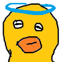 |
| `:pduck_awful:` | 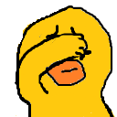 |
| `:pduck_b:` | 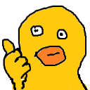 |
| `:pduck_black:` | 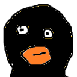 |
| `:pduck_blue:` | 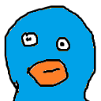 |
| `:pduck_chatter:` |  |
| `:pduck_clap:` | 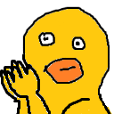 |
| `:pduck_cry:` | 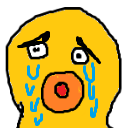 |
| `:pduck_dogeza:` | 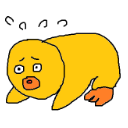 |
| `:pduck_down_l:` |  |
| `:pduck_down_r:` | 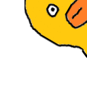 |
| `:pduck_end:` | 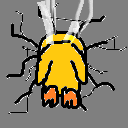 |
| `:pduck_excited:` | 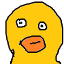 |
| `:pduck_excl:` |  |
| `:pduck_failed:` | 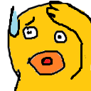 |
| `:pduck_fidgety:` |  |
| `:pduck_flattered:` |  |
| `:pduck_flower:` |  |
| `:pduck_frown:` | 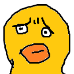 |
| `:pduck_goodbye:` | 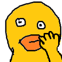 |
| `:pduck_green:` | 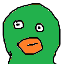 |
| `:pduck_happy:` | 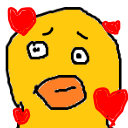 |
| `:pduck_hit:` | 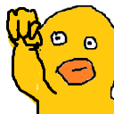 |
| `:pduck_ikemen:` | 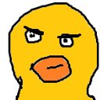 |
| `:pduck_injured:` |  |
| `:pduck_king:` |  |
| `:pduck_melt:` |  |
| `:pduck_no:` |  |
| `:pduck_nod:` | 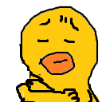 |
| `:pduck_o:` | 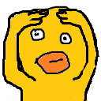 |
| `:pduck_oh:` | 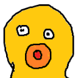 |
| `:pduck_ohhhh:` | 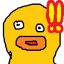 |
| `:pduck_punch:` | 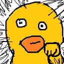 |
| `:pduck_purple:` | 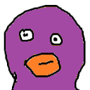 |
| `:pduck_question:` | 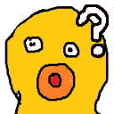 |
| `:pduck_red:` | 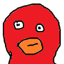 |
| `:pduck_roger:` | 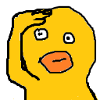 |
| `:pduck_rotation_y:` |  |
| `:pduck_rotation_z:` | 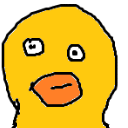 |
| `:pduck_scaling:` |  |
| `:pduck_scrub:` | 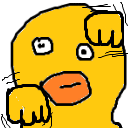 |
| `:pduck_shock:` | 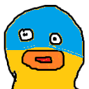 |
| `:pduck_sitting:` | 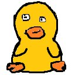 |
| `:pduck_sitting_bow:` | 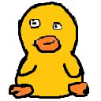 |
| `:pduck_slide:` |  |
| `:pduck_success:` | 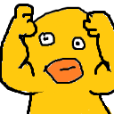 |
| `:pduck_thinking_face:` | 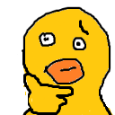 |
| `:pduck_wave:` | 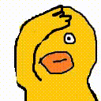 |
| `:pduck_x:` | 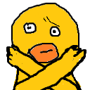 |
| `:pduck_yes:` |  |